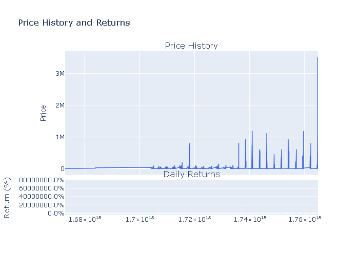
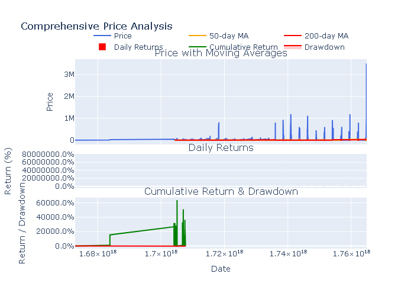
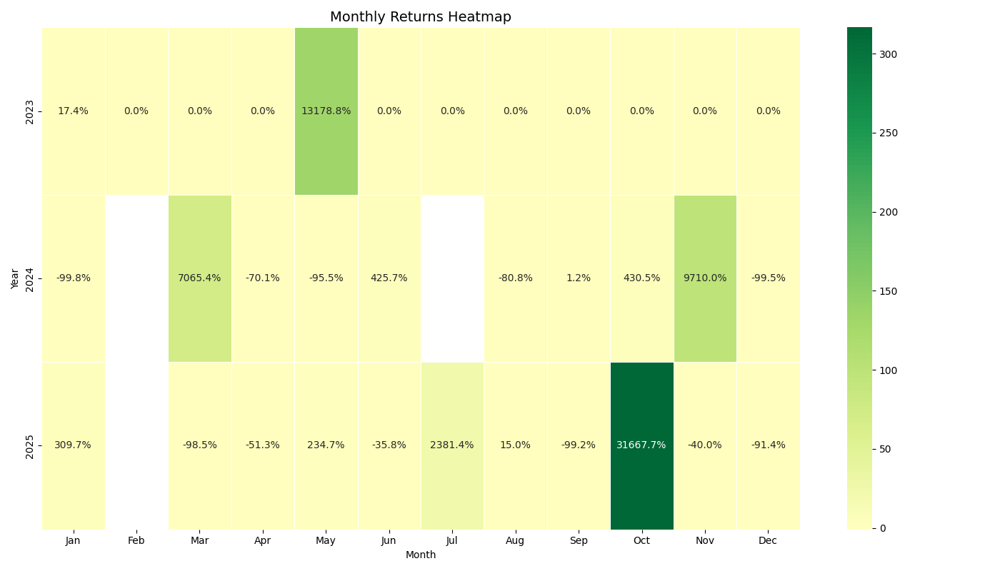
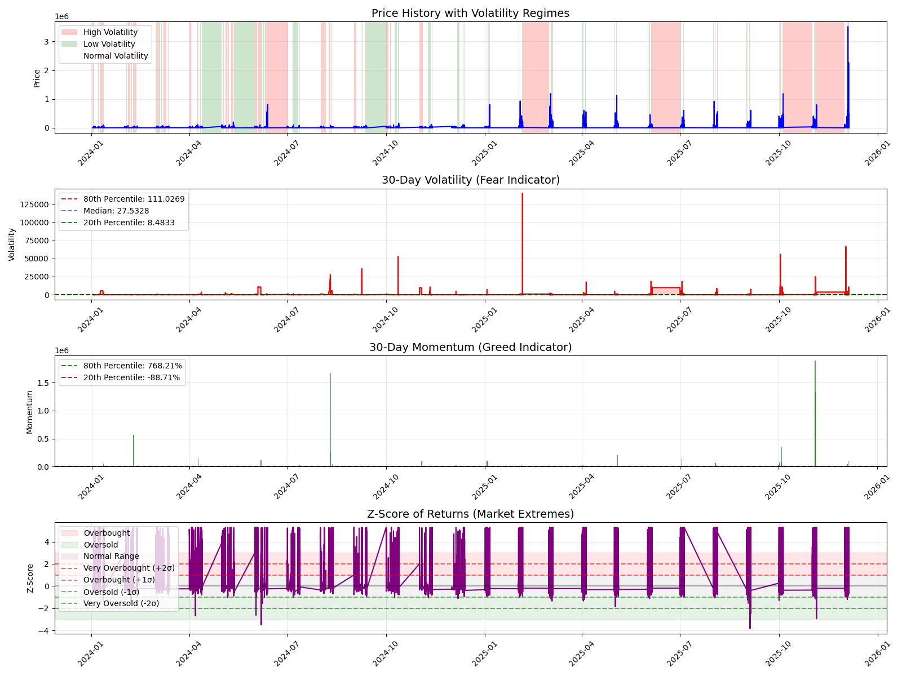
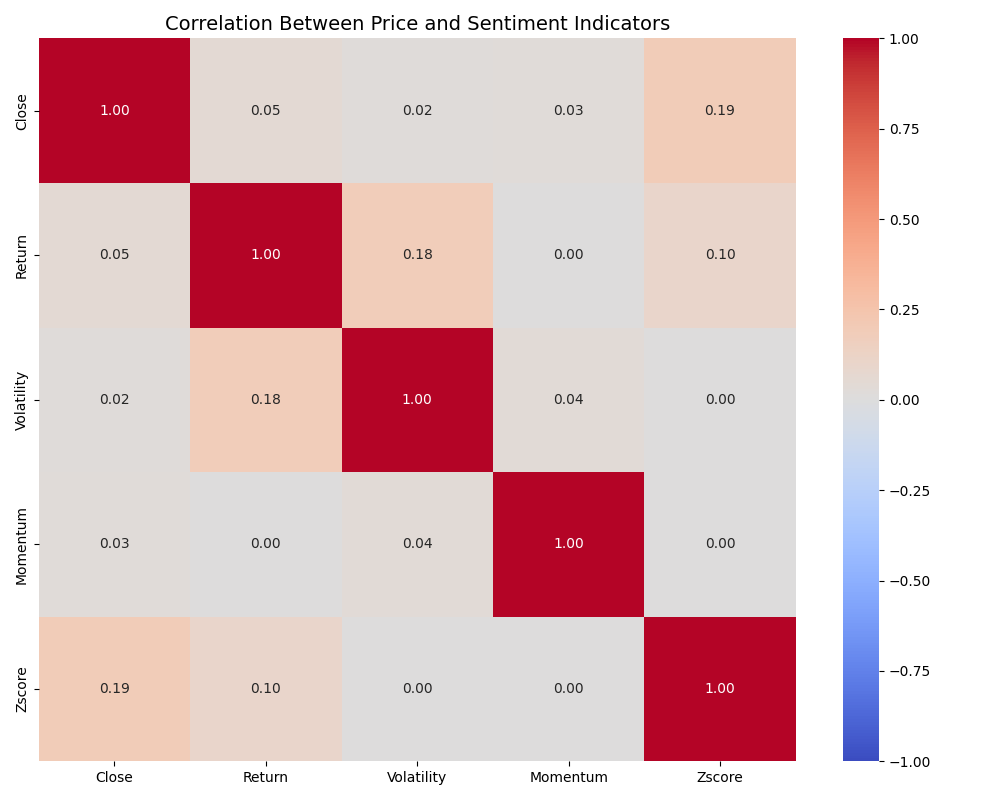
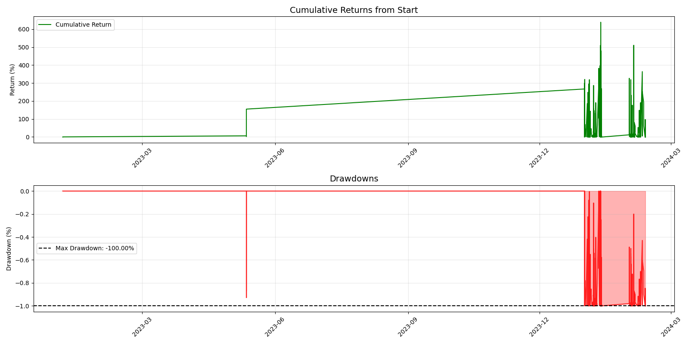
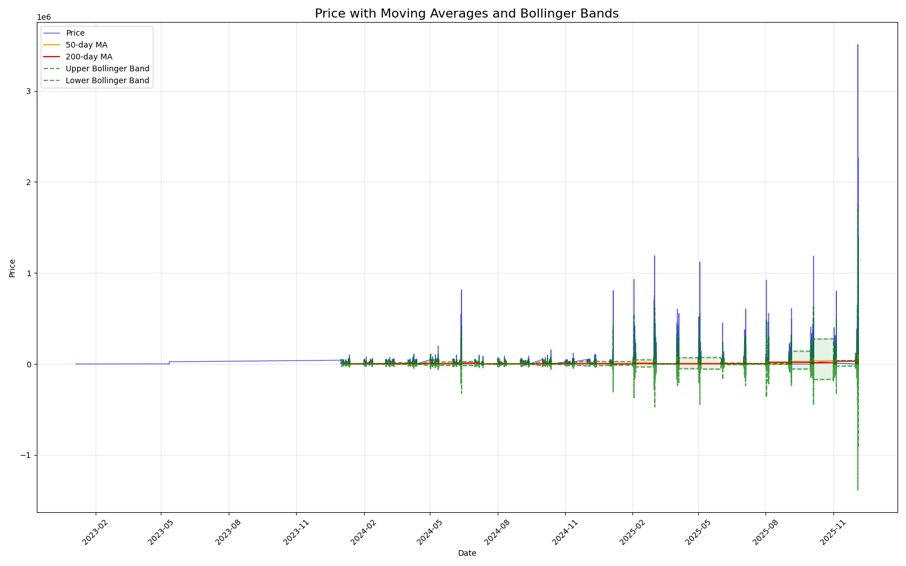
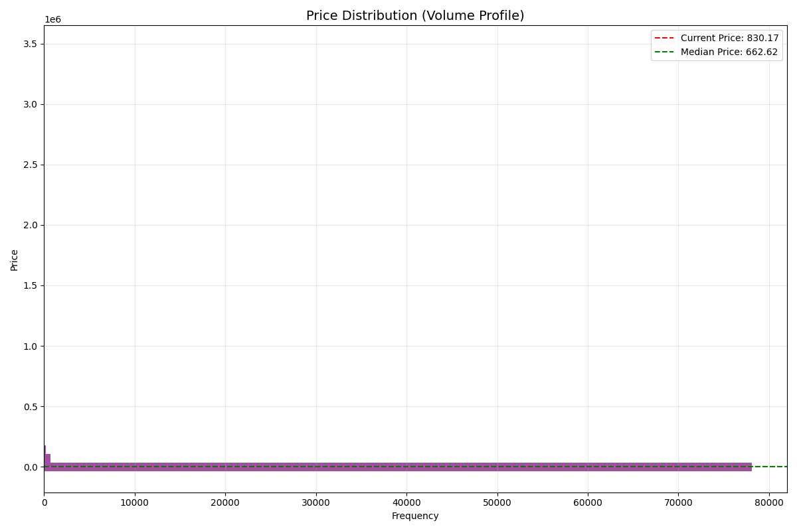

# Cryptocurrency Market Analysis and Trading Strategy



## Project Overview

This project provides a comprehensive analysis of cryptocurrency price data to develop and evaluate market sentiment-based trading strategies. Using historical price data, we extract sentiment indicators and implement systematic trading rules to capture market inefficiencies based on different hypotheses about market behavior.

## Key Features

- **Data Analysis**: Comprehensive exploration of historical cryptocurrency price data
- **Sentiment Indicators**: Creation of market sentiment metrics based on price action
- **Trading Strategies**: Implementation of three distinct trading approaches with transaction cost modeling
- **Performance Evaluation**: Rigorous assessment of strategy performance against buy-and-hold

## Data Analysis

The analysis begins with loading and processing historical cryptocurrency price data, ensuring proper handling of timestamps and consistent column naming. The data spans multiple trading periods and includes daily closing prices from which we calculate returns.



### Price Visualization

- **Price History**: Interactive and static visualizations of historical price movements
- **Returns Analysis**: Distribution analysis of daily returns
- **Rolling Statistics**: Moving averages and volatility bands to identify trends
- **Seasonality Analysis**: Monthly returns heatmap to identify seasonal patterns



## Sentiment Indicators

Three key sentiment indicators derived from price action provide the foundation for our trading strategies:

1. **Volatility (30-day)**: A proxy for market fear - higher volatility indicates increased uncertainty
2. **Momentum (30-day)**: A proxy for market greed - positive momentum suggests optimism
3. **Z-score of Returns**: Measures how current returns deviate from the recent average



The correlation between these indicators helps understand market dynamics:



## Trading Strategies

Based on the sentiment indicators, three distinct trading strategies were implemented:

1. **Strategy A (Momentum Follower)**: Goes long when momentum is positive (> 0)
   - Follows market trends, assuming recent momentum will continue

2. **Strategy B (Contrarian Volatility)**: Goes long when volatility is above its 60-day average
   - Buys during high volatility periods expecting a rebound

3. **Strategy C (Extreme Fear)**: Goes long when Z-score is below -1
   - Buys during statistically significant price drops, betting on mean reversion

### Performance Metrics

Each strategy is evaluated with realistic transaction costs (10 basis points) and compared against a buy-and-hold benchmark. Performance metrics include:

- Cumulative returns
- Risk-adjusted returns (Sharpe ratio)
- Drawdowns
- Percentage of time invested



## Technical Indicators

Additional technical analysis provides context for strategy development:

- Moving averages (50-day and 200-day)
- Bollinger Bands
- Golden and death crosses



## Price Distribution Analysis

Understanding price distribution helps identify key support and resistance levels:



## Setup and Configuration

The analysis uses the following configuration parameters:

- Transaction costs: 10 basis points (0.1%)
- Risk-free rate: 2% (for Sharpe ratio calculations)

## Requirements

This project requires the following Python packages:

- numpy
- pandas
- matplotlib
- seaborn
- plotly
- scipy

## Usage

To run the analysis, execute the Jupyter notebook:

```bash
jupyter notebook "historical_data(Notebook_2).ipynb"
```

## File Structure

- `historical_data(Notebook_2).ipynb`: Main Jupyter notebook with all analysis code
- `csv_files/historical_data (1).csv`: Historical price data
- `output/`: Generated visualizations and analysis results
- `save_matplotlib_plots.py`: Utility script for saving matplotlib visualizations

## Author

Khushi Kumari

## License

This project is provided for educational purposes only. Use at your own risk.
